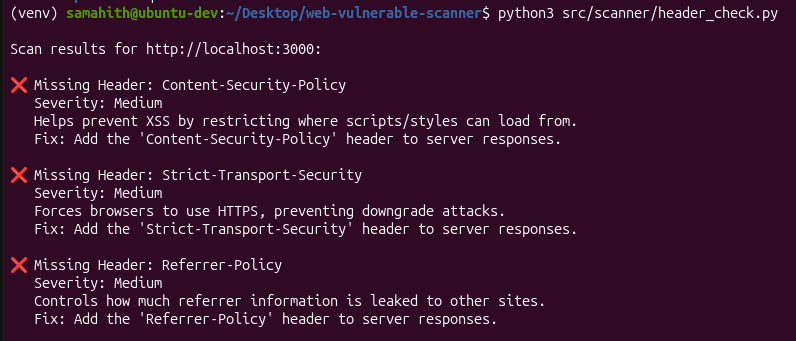
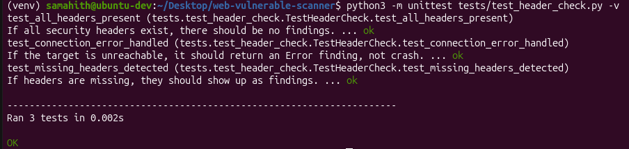

# Web Vulnerability Scanner

A learning-focused web application vulnerability scanner built in Python, mapped to the OWASP Top 10 (2021).

⚠️ **For educational use only.** Only scan applications you own or intentionally vulnerable targets like [OWASP Juice Shop](https://owasp.org/www-project-juice-shop/). Never scan third-party sites without explicit permission.

## Features (in progress)
- [x] Security header checker
- [ ] Site crawler
- [ ] Reflected XSS detection
- [ ] CSRF token detection
- [ ] Outdated JS library detection
- [ ] HTML/PDF report generation

## Screenshots

**Header checker in action (against OWASP Juice Shop):**


**Unit tests passing:**


## Setup

```bash
git clone https://github.com/Samahith72/web-vulnerable-scanner.git
cd web-vulnerable-scanner
python3 -m venv venv
source venv/bin/activate
pip install -r requirements.txt
```

## Usage

```bash
python3 src/scanner/header_check.py
```

## Running Tests

```bash
python3 -m unittest discover tests
```

## OWASP Mapping

See [docs/OWASP_MAPPING.md](docs/OWASP_MAPPING.md) for how each feature maps to the OWASP Top 10.

## Disclaimer

This tool is built for personal learning purposes. Always get explicit authorization before scanning any system you don't own.
