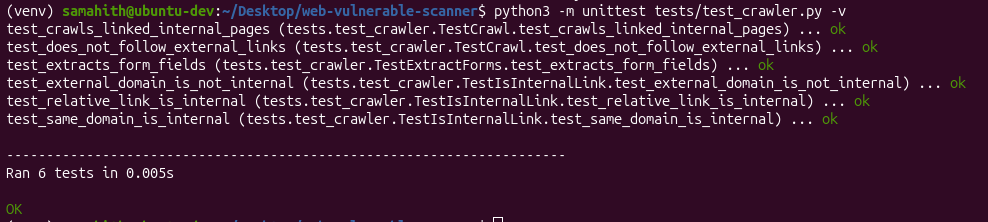
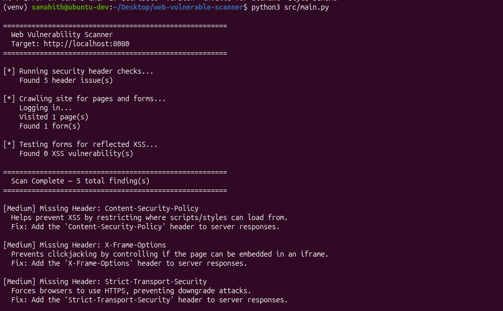
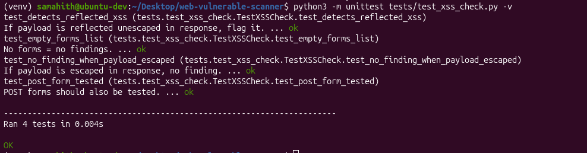
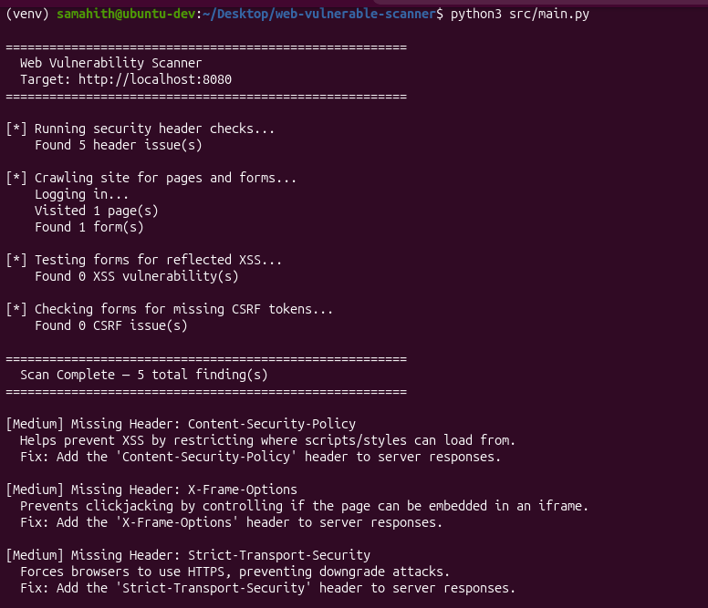
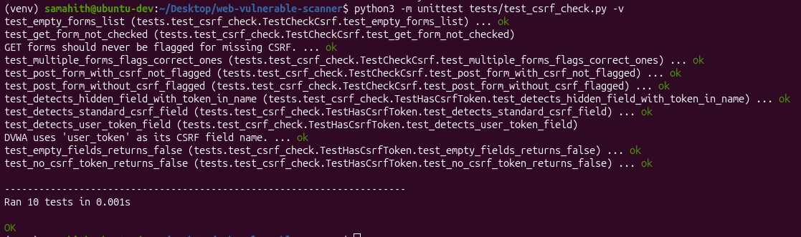

# Web Vulnerability Scanner

A learning-focused web application vulnerability scanner built in Python,
mapped to the OWASP Top 10 (2021).

> ⚠️ **For educational use only.** Only scan applications you own or
> intentionally vulnerable targets like DVWA or OWASP Juice Shop.
> Never scan third-party sites without explicit written permission.

---

## Features

- [x] Phase 1 — Security header checker (OWASP A05:2021)
- [x] Phase 2 — Site crawler with form extraction
- [x] Phase 3 — Reflected XSS detection (OWASP A03:2021)
- [x] Phase 4 — CSRF token detection (OWASP A01:2021)
- [ ] Phase 5 — Outdated JS library detection (OWASP A06:2021)
- [ ] Phase 6 — HTML report generation

---

## Practice Target Setup (Ubuntu)

All scanning is done against intentionally vulnerable apps running
locally via Docker. **Never point this scanner at real websites.**

### OWASP Juice Shop
```bash
docker pull bkimminich/juice-shop
docker run -d -p 3000:3000 --name juice-shop bkimminich/juice-shop
```
Visit: `http://localhost:3000`
> Used for Phase 1 (header checks only). Juice Shop is a modern SPA —
> the crawler finds no links or forms due to JavaScript rendering.

### DVWA (used from Phase 3 onwards)

DVWA requires MySQL — run both together with Docker Compose:

```bash
cd dvwa-setup
docker compose up -d
```

`docker-compose.yml`:
```yaml
version: "3"
services:
  dvwa:
    image: ghcr.io/digininja/dvwa:latest
    ports:
      - "8080:80"
    environment:
      - DB_SERVER=db
      - DB_PORT=3306
      - DB_USER=dvwa
      - DB_PASSWORD=dvwa
      - DB_DATABASE=dvwa
    depends_on:
      - db
    restart: always
  db:
    image: mariadb:10.6
    environment:
      - MYSQL_ROOT_PASSWORD=dvwa
      - MYSQL_DATABASE=dvwa
      - MYSQL_USER=dvwa
      - MYSQL_PASSWORD=dvwa
    restart: always
```

Visit `http://localhost:8080/setup.php` → click **Create / Reset Database**
→ login with `admin` / `password` → set security level to **Low**.

---

## Project Setup

```bash
git clone https://github.com/Samahith72/web-vulnerable-scanner.git
cd web-vulnerable-scanner
python3 -m venv venv
source venv/bin/activate
pip install -r requirements.txt
```

---

## Usage

**Run full scan against DVWA:**
```bash
python3 src/main.py
```

**Run individual modules:**
```bash
python3 src/scanner/header_check.py
python3 src/scanner/crawler.py
```

---

## Running Tests

```bash
python3 -m unittest discover tests -v
```

---

## Screenshots

### Phase 1 — Security Header Checker

**Running against OWASP Juice Shop:**


**Unit tests passing:**


### Phase 2 — Crawler

**Unit tests passing:**


### Phase 3 — Reflected XSS Checker

**Full scan against DVWA showing XSS findings:**


**Unit tests passing:**


### Phase 4 — CSRF Token Checker

**Full scan against DVWA showing CSRF findings:**


**Unit tests passing:**


---

## Project Structure
web-vuln-scanner/
├── README.md
├── LICENSE
├── .gitignore
├── requirements.txt
├── docs/
│ ├── ARCHITECTURE.md
│ ├── OWASP_MAPPING.md
│ └── screenshots/
│ ├── phase1-header-check-run.png
│ ├── phase1-unit-tests-passing.png
│ ├── phase2-crawler-tests-passing.png
│ ├── phase3-xss-scan-run.png
│ ├── phase3-xss-tests-passing.png
│ ├── phase4-csrf-scan-run.png
│ └── phase4-csrf-tests-passing.png
├── src/
│ ├── main.py
│ └── scanner/
│ ├── init.py
│ ├── auth.py
│ ├── header_check.py
│ ├── crawler.py
│ ├── xss_check.py
│ └── csrf_check.py
└── tests/
├── test_header_check.py
├── test_crawler.py
├── test_xss_check.py
└── test_csrf_check.py


---

## OWASP Mapping

See [docs/OWASP_MAPPING.md](docs/OWASP_MAPPING.md) for how each feature
maps to the OWASP Top 10.

See [docs/ARCHITECTURE.md](docs/ARCHITECTURE.md) for how the scanner
is structured internally.

---

## Disclaimer

This tool is built for personal learning purposes only. Always obtain
explicit written authorization before scanning any system you do not own.
